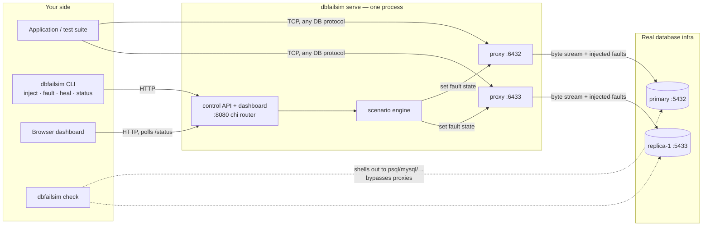

# dbfailsim — Database Failure Simulator

Chaos Monkey, but for your database layer.

Most teams never test replica lag, split brain, or partial node failure,
because it's painful to simulate against a real database. Distributed
systems fail in weird, partial ways — not clean crashes — and those are
exactly the failure modes that slip through normal testing.

`dbfailsim` plugs into your real database infrastructure with a transparent
TCP proxy per node, lets you inject network partitions, replication delays,
and node crashes on demand (or as reproducible named scenarios), and shows
you exactly what different clients would see while it's happening.

## How it works

Point your application at `dbfailsim`'s proxy address instead of your
database directly. The proxy forwards bytes transparently to the real
upstream — it's protocol-agnostic, so it works with Postgres, MySQL, or
anything else over TCP. When you inject a fault, it's applied to that
byte stream in real time:

- **wire faults** on a connection — `latency` (fixed, jittered, or ramping),
  `drop`, `bursty_loss`, `bandwidth_throttle`, `reorder`, `duplication`,
  `tcp_rst`, `asymmetric_partition` (one direction only)
- **reachability** — `partition` (refuse new connections, sever existing
  ones) and `crash` (same effect, reported separately)
- **dial faults** — `dns_failure` fails the upstream dial itself
- **packet faults**, gated by the proxy's stream type — `replica_lag`,
  `wal_delay`, `wal_corruption` on a replication proxy; `query_corruption`
  on a query proxy; `stale_read` serves a cached older response
- **node faults** on nodes with a `target` — `node_crash` (SIGKILL/SIGTERM),
  `zombie` (freeze), `cpu_throttle`, `oom`, `clock_skew`. The fault says
  *what*; the node's target says *how*: a local process (pid / pid file),
  a systemd unit, a docker container, or any of those on another host over
  ssh. A node without a target (a managed database) only gets proxy-level
  faults, and the engine says so instead of guessing.

The fault model is larger than what the engine can trigger today: the
`faults` package also defines topology faults (group partition, split
brain, quorum loss, election storm), stored-data faults (log divergence,
row corruption), workload faults (pool exhaustion, deadlock, lock
contention, mid-transaction failover) and client-visible consistency
faults (read-your-writes, monotonic reads). Those have implementations and
interfaces but no scenario-engine case yet — see "What's implemented".

A **scenario** is a named, timed sequence of these faults, so "split-brain"
or "replica-lag" is one command instead of manual toggling. Every step can
carry a `for_ms` window after which the engine removes the fault again.

The **consistency check** (`dbfailsim check`) is the payoff: it runs the
same read against every node directly (bypassing the proxy, so it reflects
real database state) and tells you whether they agree. That's the concrete,
visible proof of what your chaos experiment actually did to your data.

## Architecture

One `dbfailsim serve` process runs a fault-injecting TCP proxy per
configured node plus the HTTP control plane. Each proxy owns a **fault
registry** — the live set of connection, dial, packet and read-hook faults
for that node — and a small **state** for partition/crash. A single
**scenario engine** turns every fault step (from a scenario or from the
API) into a registry, state or docker action. The CLI's `inject` / `fault`
/ `heal` / `status` subcommands are thin HTTP clients against the control
API — the same API the dashboard and your CI scripts use. `check` is the
exception: it bypasses the proxies entirely and shells out to a real
database client against each node, so it reports true database state.



Package layout:

| Package | Role |
|---|---|
| `cmd/dbfailsim` | CLI entry point; subcommands are HTTP clients of the control API |
| `internal/proxy` | Protocol-agnostic TCP proxy; per-node fault `Registry` (conn/dial/packet/read-hook faults, live re-wrap of open connections), `State` for partition/crash, optional `ClusterView` gating for inter-node proxies |
| `internal/faults` | The fault model: connection, dial, packet, node, topology, data, workload and consistency fault types; `NodeDriver` backends (process, systemd, docker, ssh) that node faults act through |
| `internal/scenario` | The single fault engine: turns a `config.FaultStep` into registry/state/docker actions; runs timed scenarios |
| `internal/control` | chi-routed HTTP API + embedded web dashboard (routes faults through the same engine) |
| `internal/check` | Cross-node consistency check via each node's `check_command` |
| `internal/config` | The single YAML schema: nodes (incl. `target`, `role`, `stream`), scenarios, control address |
| `internal/raft` | Raft leader election (terms, roles, randomized timeouts, `RequestVote`, heartbeats) as a pure `Tick`/`Step` state machine plus an in-memory simulated cluster with partitions — not yet wired to the proxies |

A 300-page walkthrough of the codebase, its fault model and the roadmap is
in `dbfailsim-walkthrough.pdf` at the repository root.

## Quick start

See [TEST.md](TEST.md) for a full guide to testing against real databases
(local Docker, Neon, or a VPS).

```bash
go build -o dbfailsim ./cmd/dbfailsim
go test ./...   # optional: run the test suite

# Edit config.example.yaml: point listen_addr/upstream_addr at your real
# DB nodes, and set check_command to a psql/mysql one-liner for each node.
cp config.example.yaml config.yaml

# Start the proxies + control API
./dbfailsim serve --config config.yaml &

# Point your app / psql / your test suite at the *proxy* addresses
# (listen_addr from config.yaml) instead of the real DB ports.

# Run a named scenario
./dbfailsim inject --config config.yaml --scenario replica-lag

# See current fault state on every node
./dbfailsim status --config config.yaml

# See what each node's clients would actually observe right now
./dbfailsim check --config config.yaml --query "SELECT balance FROM accounts WHERE id=1"

# One-off fault instead of a full scenario
./dbfailsim fault --config config.yaml --node replica-1 --kind latency --value 2000
./dbfailsim fault --config config.yaml --node replica-1 --kind reorder --params '{"buffer_size":5}' --for 5000
./dbfailsim fault --config config.yaml --node replica-1 --kind reorder --remove   # remove one fault
./dbfailsim kinds                                                                  # the fault catalogue

# Recover
./dbfailsim heal --config config.yaml
```

## Config format

See `config.example.yaml`. Each node needs:

- `name` — used to refer to the node in scenarios and CLI flags
- `listen_addr` — where dbfailsim's proxy listens (point your app here)
- `upstream_addr` — the real database address
- `check_command` (optional) — a shell command template for `dbfailsim check`,
  with `{query}` substituted for the query text. This is what lets the tool
  "plug into your DB infra" without needing a driver for every database —
  it shells out to whatever client you already have installed (`psql`,
  `mysql`, `redis-cli`, etc.).
- `target` (optional) — how node-level faults reach this node's process.
  Required for `node_crash`, `zombie`, `cpu_throttle`, `oom`, `clock_skew`;
  omit it for a managed database. One of:
  - `{type: process, pid: 1234}` or `{type: process, pid_file: /run/pg.pid, start_command: "pg_ctl start"}`
    — signals and freeze work; `node_crash` can only be reverted with a
    `start_command`; CPU/memory limits are unsupported (a bare process has
    no cgroup of its own).
  - `{type: systemd, unit: postgresql}` — everything, via `systemctl kill`
    / `start` / `set-property --runtime`.
  - `{type: docker, container: dbfailsim-primary, network: docker_default}`
    — everything, via the docker CLI; `network` is used by quorum-loss
    isolation.
  - `{type: ssh, host: user@db2.internal, inner: {...}}` — runs the inner
    target's commands on another host through your local `ssh`.
- `role` (optional) — a free-form label (`primary`, `replica`, `voter`).
- `stream` (optional) — `query` (default) or `replication`. Packet-level
  faults (`replica_lag`, `wal_delay`, `wal_corruption`) only act on a
  `replication` proxy.

Scenarios are named sequences of fault steps, each with an `after_ms`
offset from when the scenario starts and an optional `for_ms` after which
the engine removes the fault again. A step is either the **short form**
(`latency` + `latency_ms`, `drop` + `drop_percent`, or the parameterless
`partition` / `crash` / `heal`) or the **general form**: any kind the
engine knows with kind-specific `params`:

```yaml
- node: replica-1
  kind: latency
  after_ms: 0
  for_ms: 45000
  params: {delay: 50ms, jitter: 20ms, ramp_to: 3s, ramp_over: 30s}
```

Kinds: `latency`, `drop`, `partition`, `crash`, `heal`, `bandwidth_throttle`,
`bursty_loss`, `reorder`, `duplication`, `asymmetric_partition`, `tcp_rst`,
`dns_failure`, `replica_lag`, `wal_delay`, `wal_corruption`,
`query_corruption`, `stale_read`, `node_crash`, `clock_skew`,
`cpu_throttle`, `oom`, `zombie`. Durations in `params` are strings
(`500ms`) or milliseconds as numbers. `"node": "*"` targets every node.

## Control API and dashboard

`dbfailsim serve` exposes a small HTTP API (`control_addr` in config), so
faults can be triggered from CI, a test harness, a curl script, or the
built-in dashboard:

- `GET  /status` — every node: proxy state (`partitioned`, `crashed`,
  `active_faults`, `active_clients`, `stream`) plus `role`, `target`
  (e.g. `docker:dbfailsim-primary`, empty for proxy-only nodes) and
  `node_faults` currently injected on the process
- `GET  /kinds` — the fault catalogue: every kind with its class, description,
  parameters, defaults, and whether it needs a target or a specific stream.
  The dashboard's inject form and `dbfailsim kinds` are built from it.
- `GET  /scenarios` — the named scenarios defined in your config
- `GET  /check?query=<query>` — run the consistency check and return JSON
- `POST /nodes/{node}/fault` — apply one fault, same shape as a scenario step
  minus the node: `{"kind":"latency","latency_ms":2000}` or
  `{"kind":"reorder","params":{"buffer_size":5},"for_ms":5000}`. `{node}`
  may be `*`.
- `DELETE /nodes/{node}/faults/{name}` — remove one fault: a registry fault
  by name, `partition`/`crash`, or an injected node-level fault (reverted)
- `POST /scenarios/{name}/run` — run a named scenario from the config
- `POST /heal` — clear all fault state and revert every node-level fault

Routing is [chi](https://github.com/go-chi/chi) with request logging and
panic recovery middleware; wrong-method requests get a proper `405`.

**Auth:** set `control_token` in the config (or the `DBFAILSIM_CONTROL_TOKEN`
environment variable, which overrides it) and every API request must carry
`Authorization: Bearer <token>` or it gets a `401`. The CLI subcommands pick
the token up from the same config/env automatically; the dashboard prompts
for it on first load and remembers it in localStorage. The dashboard's
static files stay public — only the API is gated. With no token configured
the API is open, and `serve` logs a loud warning: don't expose it beyond
localhost that way, since the API can sever connections and `/check` runs
shell commands from your config.

Open `http://<control_addr>/` (e.g. `http://127.0.0.1:8080/`) in a browser
for a live dashboard:

- **Node cards** — role, stream, target, reachability, and a chip for every
  live fault (registry faults, partition/crash, node-level faults) with a
  one-click remove; quick buttons for latency, drop, RST, partition, crash,
  and — on nodes with a target — kill and zombie.
- **Inject form** — pick a node (or `*`), any kind from the catalogue, its
  parameters pre-filled with defaults, and an optional `for` window.
- **Scenarios** — each with its step list, one-click run.
- **Consistency check**, the **fault catalogue** as reference, and an
  **activity log**.

It polls `/status` every 1.5s, so you can watch a scenario unfold in real
time. No build step — plain HTML/CSS/JS embedded into the binary via
`go:embed`.

## Docker Compose demo (real Postgres, not a mock)

`docker/` has a self-contained harness: a real Postgres primary, a real
streaming-replication replica (built via `pg_basebackup`, not simulated),
and `dbfailsim` fronting both with proxies and the dashboard.

```bash
cd docker
docker compose up --build
```

Then:
- Dashboard: http://localhost:8080
- App traffic goes to the *proxies*, not the real DB ports directly:
  primary proxy on `localhost:6432`, replica proxy on `localhost:6433`
- Real Postgres ports are still exposed too (primary on `15432` to avoid
  colliding with a locally running Postgres, replica on `5433`) if you want
  to connect directly for setup/debugging

Try it end to end:
1. Open the dashboard, note both nodes show "reachable"
2. Run the `replica-lag` scenario (or click "20% drop" on `replica` manually)
3. In the Consistency check panel, run `SELECT balance FROM accounts WHERE id=1`
   a few times — since replication is real, you may or may not see divergence
   depending on timing, which is itself the point: partial failure is
   probabilistic, not a clean on/off switch
4. Click "Crash" on `primary` and watch `active clients` drop and the node
   go red
5. Click "Heal all" to recover

This harness has been run and verified end to end: primary init, replica
clone via `pg_basebackup`, live WAL streaming, the original four fault
kinds through the proxies, scenario execution, forced-divergence detection
via `/check`, and heal recovery. See TEST.md §3a for the full walkthrough
and a deterministic way to make the consistency check show divergence.

Two caveats for the newer fault kinds in this harness:

- The harness nodes declare `target: {type: docker, ...}`, so node faults
  run the docker CLI from the process running `serve`. The `dbfailsim`
  container has no docker CLI or socket, so the `flaky-replica` scenario's
  `node_crash` step fails there; run `serve` on the host (with
  `docker/config.docker.yaml` adapted to `localhost` addresses) or mount the
  docker socket and CLI into the container.
- Packet faults on the replication stream have nothing to act on yet,
  because WAL flows between the Postgres containers directly (Phase 0 of
  the roadmap adds the replication-path proxy).

## What's implemented vs. what's next

**Working now, tested against a live TCP backend:**

- the protocol-agnostic proxy with a per-node fault registry: connection
  faults wrap each pump's destination and are re-applied live when the
  registry changes; dial faults run before the upstream dial; packet
  faults run per chunk with a cancellable context and the proxy's stream
  type; read hooks pair replies with the last query; partition/crash
  sever connections and cancel in-flight fault sleeps
- the `faults` package: eight interface families (connection, time-varying,
  dial, packet, node, topology, data, workload, consistency) and ~30
  concrete fault types
- one YAML config and one scenario engine: short-form steps (`latency_ms`,
  `drop_percent`) and general-form steps (`kind` + `params` + `for_ms`),
  `"*"` targeting, automatic expiry, node faults via docker with tracked
  revert on heal
- HTTP control API (routing one-off faults through the same engine; per-node
  status with role/target/stream and node faults; the fault catalogue at
  `/kinds`; per-fault removal), the CLI (`fault --params/--for/--remove`,
  `kinds`), the shell-out consistency checker, and a dashboard that exposes
  every kind through a catalogue-driven inject form
- the Docker harness: real Postgres primary + streaming replica
- `internal/raft`: the election half of Raft as a deterministic state
  machine, with a simulated network and tests for the safety property and
  each partition demo (leader isolation, no-majority stall, minority side,
  one-way link, deposed leader steps down)

Every package has a test suite (`go test -race ./...`, race-detector
clean): proxy and registry integration tests against real TCP, HTTP tests
for every endpoint, engine tests over live proxies.

**Known gaps, in rough priority order:**

- In the Docker harness the WAL stream still bypasses the proxies, so
  `replica_lag`/`wal_delay` have nothing real to act on until a
  replication-path proxy exists (Phase 0). The `stream: replication` config
  and `Proxy.Stream` wiring are in place.
- Topology, data, workload and consistency faults have no engine case
  (they need a `ClusterView`, `DataStore` or `DBSession` on the engine).
  `CrashLoopFault`, `DiskFullFault` and `DiskIOLatencyFault` exist but
  are not reachable from a scenario either.
- Raft has no transport: participants are not yet embedded in `serve` or
  routed over proxied links, so injected faults cannot reach an election.
- `ReorderFault` holds buffered chunks until the buffer fills and does not
  flush on close; `StaleReadFault` retains the slice it is given.

**What's next:** see the [Roadmap](#roadmap) below — a staged plan to grow
this from a chaos injector into a working tour of distributed-systems
theory. Items already delivered are ticked in their milestone lists.

## Roadmap

The goal of this project from here on is to **build real distributed-systems
understanding by implementing the classic ideas against live failures** —
not reading about causality or quorums, but watching them work (and break)
through this tool. Each item below names the concept it teaches, a concrete
design mapped to this codebase, milestones, and the canonical thing to read
alongside.

Rough dependency order: Phase 0 is groundwork several later items need.
Items 1–2 build the *observation and verification* muscle (causality,
histories, correctness). Items 3–6 each implement a different *coordination
strategy* and show it under partition. Item 7 sharpens the *fault model*
everything else rests on.

### Phase 0 — Groundwork

Small infrastructure pieces that later phases depend on:

- **Per-direction (asymmetric) faults.** *Largely done.* Real network
  failures are often asymmetric — A can reach B but not vice versa — and
  one-way partitions are what make split-brain and failure-detector
  scenarios genuinely interesting. `faults.Direction`,
  `asymmetric_partition` (`block_direction: inbound|outbound`) and the
  proxy's per-leg wrapping deliver this. Remaining: a `direction` param on
  latency/drop/throttle so they can be one-way too, and dashboard controls.
- **Single schema and engine.** *Done.* One YAML config (`internal/config`)
  and one `scenario.Engine` whose `Apply` is the path for every fault, from
  scenarios and from the API alike.
- **Replication-path proxying.** In the Docker harness the replica streams
  WAL from the primary *directly*, so injected faults never touch
  replication (see TEST.md §3a). Add a third proxy node fronting the
  primary's replication port and point the replica's `primary_conninfo` at
  it. After this, `replica-lag` scenarios cause *real* WAL delay, and the
  consistency check diverges deterministically — needed for items 1 and 2
  to have something honest to measure.
- **Event timeline recording.** Every fault application, heal, connection
  open/sever, and check result gets appended to a timestamped in-memory
  event log, exposed as `GET /events` and rendered as a timeline in the
  dashboard. Scenario runs become replayable postmortem reports. This is
  also the substrate for item 2's operation history.
- (Backlog, non-learning: point `check` at Kubernetes StatefulSet pods
  instead of a static node list.)

### 1. Vector clocks / logical time on the proxy

**Concept:** logical time and the happens-before relation — the foundation
under everything else here. The payoff is upgrading `check`'s verdict from
"outputs don't match" to "outputs don't match, **and here's why in causal
terms**": divergence that is causally *ordered* (replica is behind, will
converge) versus genuinely *concurrent* writes (no happens-before relation
— a real conflict no amount of waiting will fix).

**Design.** The proxy is a byte-copier today; tagging *writes* means it must
recognize them. Add a minimal, read-only Postgres wire-protocol sniffer to
the pump: after the startup phase, frontend messages are typed (`Q` simple
query, `P` parse, etc.), so classifying "this chunk contains a write" is a
message-type check plus a conservative `INSERT/UPDATE/DELETE` prefix match
— no rewriting, no full SQL parser. Then:

- Start with **Lamport clocks**: one counter per node, ticked on every
  observed write, exchanged via the control plane; store `(node, counter)`
  per observed write in the event log.
- Upgrade to **vector clocks**: each node keeps a vector of all nodes'
  counters; `check` results are annotated by comparing vectors — `VC(a) <
  VC(b)` means causally ordered, incomparable vectors mean concurrent.
- `check` output and the dashboard gain a verdict line:
  `DIVERGES (causally behind — stale but consistent)` vs
  `DIVERGES (concurrent writes — conflict)`.

**Milestones**
- [ ] Wire-protocol sniffer: count reads vs writes per node in `/status`
- [ ] Lamport clock per node, visible in the event timeline
- [ ] Vector clocks + comparison logic (with unit tests over the partial order)
- [ ] `check` annotates divergence as *ordered* vs *concurrent*
- [ ] Demo scenario: split-brain with writes on both sides → conflict verdict;
      paused replica → stale-but-consistent verdict

**Read:** Lamport, *Time, Clocks, and the Ordering of Events* (1978);
Fidge/Mattern on vector clocks; DDIA ch. 5 ("Detecting Concurrent Writes").

### 2. A Jepsen-style linearizability checker

**Concept:** consistency models as *properties of observed histories*, not
vibes. Instead of diffing two rows, record the full operation history —
which client invoked what, when, and what it got back — and mechanically
verify whether that history could have been produced by a linearizable (or
sequentially consistent) system. This is a small reimplementation of what
Jepsen/Knossos/Porcupine do, and it's the difference between "eyeballing
that two rows differ" and "proving the observed history is impossible under
the claimed model."

**Design.** The proxy can't reliably reconstruct semantic operations from
the byte stream, so generate the workload ourselves: a new
`dbfailsim workload` subcommand runs N concurrent clients against a single
register (one row) through the proxies — reads, writes, maybe
compare-and-set via `UPDATE ... WHERE balance = $expected`. Each client
records `(client, op, args, invoke_ts, return_ts, result)` into a history
(JSON, and into the Phase-0 event log). Then `dbfailsim verify` runs the
checker over the history:

- Implement the **Wing & Gong / Porcupine-style search**: try to find a
  legal sequential ordering of operations consistent with real-time bounds
  (an op's linearization point must fall between invoke and return).
  Exponential in the worst case; fine at this scale, and *why* it's
  exponential is part of the lesson.
- Report either a witness (a valid linearization) or a minimal
  counterexample: "read at t=3.2s returned 1000, but every legal ordering
  requires it to return 1111."
- Run it under scenarios: a paused replica read during partition should
  produce a formally-detected linearizability violation; the same history
  may still satisfy *sequential* consistency — implement both checks to
  see the models separate.

**Milestones**
- [ ] `workload` subcommand: concurrent register clients + history recording
- [ ] History format + golden test histories (known-good, known-broken)
- [ ] Linearizability checker with real-time constraints + counterexample output
- [ ] Sequential-consistency variant (drop real-time constraint) — observe
      histories that pass one and fail the other
- [ ] Scenario integration: `run scenario X under workload Y, then verify`
      as one command

**Read:** Herlihy & Wing, *Linearizability: A Correctness Condition* (1990);
Kyle Kingsbury's Jepsen analyses (jepsen.io); Porcupine's design notes;
DDIA ch. 9.

### 3. Quorum reads/writes simulation

**Concept:** Dynamo-style tunable consistency — N replicas, W-write and
R-read quorums, and exactly when `R + W > N` buys you overlap (and what it
still *doesn't* buy you) versus `R + W ≤ N` where stale reads are
structurally possible.

**Design.** Postgres doesn't do leaderless quorums, so this is a simulation
layer: a new `internal/quorum` package runs N in-memory versioned KV nodes,
each fronted by a real dbfailsim proxy (the faults stay real even though
the store is simulated). A coordinator endpoint
(`POST /quorum/write`, `GET /quorum/read`) fans out to all N through the
proxies, waits for W (or R) acks with a timeout, and reports per-node
responses, versions seen, and whether quorum was reached. Config gains a
`quorum: {n: 3, w: 2, r: 2}` block; the dashboard gets a panel showing each
node's version and the last operation's vote tally.

- Partition one node with `R + W > N`: reads still overlap the latest
  write — show *which* node provided the overlap.
- Set `R = W = 1`: watch stale reads appear under the same partition.
- Partition two of three: writes fail at W=2 — quorum unreachable, the
  system chose C over A.
- Stretch: read-repair on quorum reads, then sloppy quorums / hinted
  handoff to show why "quorum" in Dynamo is weaker than it sounds.

**Milestones**
- [ ] In-memory versioned KV node behind each proxy
- [ ] Coordinator with configurable N/W/R + per-op vote reporting
- [ ] Dashboard panel: per-node versions + quorum outcomes live
- [ ] Scripted demos: overlap at R+W>N, staleness at R+W≤N, unavailability
      at lost quorum
- [ ] (Stretch) read-repair; sloppy quorum + hinted handoff

**Read:** the Dynamo paper (DeCandia et al., 2007); DDIA ch. 5
("Quorums for reading and writing").

### 4. Failure detectors

**Concept:** real systems never *know* a node is dead — they *suspect* it,
on a spectrum, from timeouts. Today `crash` is instant and perfectly known
(the injector cheats: it *is* the failure). A phi-accrual failure detector
(Cassandra's/Akka's approach) makes the gap between "actually crashed" and
"detected as crashed" visible and measurable.

**Design.** A heartbeat monitor in `dbfailsim serve` pings each node
*through its proxy* on an interval (TCP connect, or a 1-byte round-trip),
recording inter-arrival times in a sliding window. Phi-accrual: fit the
recent inter-arrival distribution, and report
`φ = -log₁₀(P(no heartbeat by now | history))` — suspicion as a continuous
level rather than a boolean. Expose per-node φ in `/status`, plot it as a
sparkline per node card, and mark the configured suspicion threshold.

- Inject `latency` and watch φ rise and recover — a slow node looks
  exactly like a dying node for a while (that ambiguity is the whole
  point, and is why perfect failure detection is impossible in an
  asynchronous network).
- Inject `crash` and measure detection lag: the event timeline shows
  `crash injected at t=0, φ crossed threshold at t=2.7s`.
- Compare against a naive fixed-timeout detector side by side: count false
  suspicions under jitter at equal detection speed.

**Milestones**
- [ ] Heartbeat prober per node through the proxy path
- [ ] Sliding-window inter-arrival stats + φ computation (unit-tested against
      known distributions)
- [ ] φ per node in `/status` + dashboard sparklines with threshold line
- [ ] Event-timeline annotation: injected-fault time vs detection time
- [ ] Fixed-timeout comparison mode

**Read:** Hayashibara et al., *The φ Accrual Failure Detector* (2004);
Chandra & Toueg, *Unreliable Failure Detectors for Reliable Distributed
Systems* (1996) — for why detectors are the key abstraction.

### 5. Leader election under partition

**Concept:** consensus is where causality, failure detection, and quorums
all converge. A minimal Raft *election* implementation — leader election
only, no log replication — coordinating the proxies themselves (not the
database) is enough to watch real elections, split votes, and majority
math under the partitions this tool already injects.

**Design.** Each configured node gets a Raft participant embedded in
`dbfailsim serve` (follower/candidate/leader, terms, randomized election
timeouts, `RequestVote` RPCs). Participants talk to each other over
dedicated inter-node ports that are themselves routed through dbfailsim
proxies — so `partition` on a node cuts its Raft traffic too, using the
Phase-0 per-direction faults for asymmetric cases. The dashboard shows each
node's role, current term, and votes as it happens; elections land in the
event timeline.

- Partition the leader: watch a timeout fire, a new election, a new term.
- Partition 2 of 3 away from each other: split votes, term inflation,
  eventual winner — visible in the timeline.
- Partition so *no* majority exists: no leader, ever — the system is
  correctly unavailable, and you can watch candidates cycle terms
  indefinitely (CAP made concrete).
- Heal and watch the deposed leader step down on seeing a higher term.

**Milestones**
- [x] Raft election state machine (unit-tested with a simulated network,
      no real sockets) — `internal/raft`
- [ ] Inter-node RPC through dbfailsim-proxied links
- [ ] Dashboard: role/term/votes per node + election events in the timeline
- [ ] Scripted demos: leader partition, split vote, no-majority stall,
      deposed-leader step-down
- [ ] (Stretch) pre-vote extension — show how it prevents term inflation
      from a flapping node

**Read:** Ongaro & Ousterhout, *In Search of an Understandable Consensus
Algorithm* (Raft, 2014) — §5.2 is the election; the Raft visualization at
thesecretlivesofdata.com; the pre-vote section of Ongaro's thesis.

### 6. CRDT-based conflict resolution demo

**Concept:** the coordination-free alternative. Items 3 and 5 buy
consistency by *restricting availability* (quorums, leaders). CRDTs flip
the trade: every replica accepts writes always, and mathematical merge
properties (commutative, associative, idempotent) guarantee convergence
after healing — no coordinator, no election, no conflict to resolve
because the data type made conflict impossible.

**Design.** An in-memory CRDT store per node (start with a G-Counter, then
PN-Counter and OR-Set), synced by an anti-entropy gossip loop over
dbfailsim-proxied links, with endpoints to mutate and read each node's
local state. Then run the *same split-brain scenario* that produces a
conflict verdict in item 1 and a stall in item 5:

- Partition, increment the counter on both sides, observe divergent local
  states with **no rejected writes**.
- Heal, watch gossip merge state, and see `check` (pointed at the CRDT
  store) report convergence — automatically, with no coordination round.
- OR-Set demo: concurrent add/remove of the same element — show why the
  naive set doesn't converge and how observed-remove tags fix it; tie the
  tags back to item 1's vector clocks (they're the same idea).
- Contrast panel in the dashboard: same partition timeline, three
  strategies (quorum / Raft / CRDT), three different availability and
  convergence behaviors.

**Milestones**
- [ ] G-Counter with merge + gossip through proxied links
- [ ] PN-Counter and OR-Set (property-based tests: merge is commutative,
      associative, idempotent)
- [ ] `check` mode against CRDT nodes with convergence verdict
- [ ] Split-brain demo scenario: diverge → heal → auto-converge
- [ ] Dashboard contrast view: quorum vs consensus vs CRDT under the same
      partition

**Read:** Shapiro et al., *Conflict-free Replicated Data Types* (2011);
Marc Shapiro's *A comprehensive study of CRDTs*; crdt.tech.

### 7. Byzantine vs crash-fault framing

**Concept:** every fault this tool injects — and every mechanism in items
1–6 — assumes *crash-stop or omission* faults: nodes are silent or slow,
never **wrong**. That assumption is load-bearing and usually unstated.
Making it explicit, and then violating it, shows where the whole stack's
guarantees come from.

**Design.** Two parts, deliberately modest:

- **Documentation first:** a "Fault model" section in this README stating
  precisely what dbfailsim can inject (crash-stop, omission, timing) and
  what it can't (Byzantine — arbitrary/malicious behavior), and annotating
  items 3–6 with which faults their guarantees survive. Raft tolerates
  ⌊(n-1)/2⌋ *crash* faults and zero Byzantine ones; BFT protocols need
  3f+1 nodes — say why.
- **A `corrupt` fault kind:** the proxy flips bytes in forwarded chunks
  with probability p, instead of dropping them. This is a *weak* Byzantine
  fault (accidental corruption, not adaptive malice) — but it's enough to
  watch the ecosystem's defenses fire: Postgres wire-protocol errors and
  CRC failures, TLS sessions dying instantly on MAC failure (an honest
  lesson: encryption-in-transit already converts corruption into
  omission), and item 5's Raft election happily electing a corrupted-link
  candidate because crash-fault protocols have no defense — the negative
  demo is the point.

**Milestones**
- [ ] "Fault model" README section + per-item fault-tolerance annotations
- [ ] `corrupt` fault kind in proxy/scenarios/API/dashboard
- [ ] Demo: corruption through plain TCP vs through TLS (omission vs error)
- [ ] Demo: Raft election under link corruption — document what breaks and
      why crash-fault consensus can't help
- [ ] (Stretch) checksum/verify layer on the item-3 quorum store, showing
      the minimal integrity defense real systems bolt on

**Read:** Lamport, Shostak, Pease, *The Byzantine Generals Problem* (1982);
Castro & Liskov, *Practical Byzantine Fault Tolerance* (1999) — skim for
the 3f+1 bound; DDIA ch. 8 ("Byzantine Faults").
