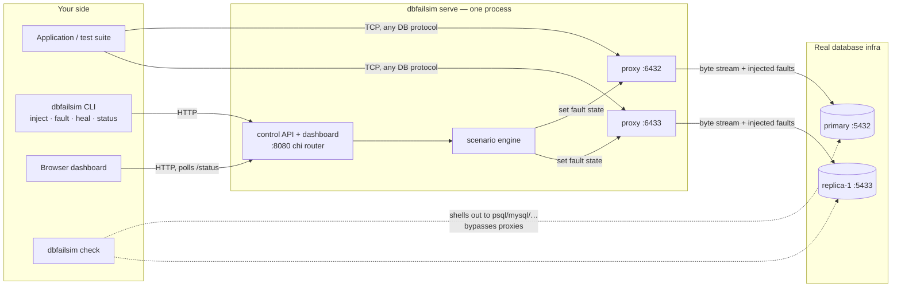

# dbfailsim — Database Failure Simulator

Chaos Monkey, but for your database layer.

Most teams never test replica lag, split brain, or partial node failure,
because it's painful to simulate against a real database. Distributed
systems fail in weird, partial ways — not clean crashes — and those are
exactly the failure modes that slip through normal testing.

`dbfailsim` plugs into your real database infrastructure with a transparent
TCP proxy per node, lets you inject network partitions, replication delays,
and node crashes on demand (or as reproducible named scenarios), and shows
you exactly what different clients would see while it's happening.

## How it works

Point your application at `dbfailsim`'s proxy address instead of your
database directly. The proxy forwards bytes transparently to the real
upstream — it's protocol-agnostic, so it works with Postgres, MySQL, or
anything else over TCP. When you inject a fault, it's applied to that
byte stream in real time:

- **latency** — added delay on every packet, simulating slow replication or network jitter
- **drop** — a percentage of packets silently discarded, simulating packet loss / a replica that never catches up
- **partition** — the node stops accepting connections and severs existing ones, simulating a network split
- **crash** — same effect as partition, reported separately for clarity

A **scenario** is a named, timed sequence of these faults, so "split-brain"
or "replica-lag" is one command instead of manual toggling.

The **consistency check** (`dbfailsim check`) is the payoff: it runs the
same read against every node directly (bypassing the proxy, so it reflects
real database state) and tells you whether they agree. That's the concrete,
visible proof of what your chaos experiment actually did to your data.

## Architecture

One `dbfailsim serve` process runs a fault-injecting TCP proxy per
configured node plus the HTTP control plane. The CLI's `inject` / `fault` /
`heal` / `status` subcommands are thin HTTP clients against that control
API — the same API the dashboard and your CI scripts use. `check` is the
exception: it bypasses the proxies entirely and shells out to a real
database client against each node, so it reports true database state.



Package layout:

| Package | Role |
|---|---|
| `cmd/dbfailsim` | CLI entry point; subcommands are HTTP clients of the control API |
| `internal/proxy` | Protocol-agnostic TCP proxy; applies latency/drop per chunk, severs connections on partition/crash |
| `internal/scenario` | Runs named, timed fault sequences against the live proxies |
| `internal/control` | chi-routed HTTP API + embedded web dashboard |
| `internal/check` | Cross-node consistency check via each node's `check_command` |
| `internal/config` | JSON config: nodes, scenarios, control address |

## Quick start

See [TEST.md](TEST.md) for a full guide to testing against real databases
(local Docker, Neon, or a VPS).

```bash
go build -o dbfailsim ./cmd/dbfailsim
go test ./...   # optional: run the test suite

# Edit config.example.json: point listen_addr/upstream_addr at your real
# DB nodes, and set check_command to a psql/mysql one-liner for each node.
cp config.example.json config.json

# Start the proxies + control API
./dbfailsim serve --config config.json &

# Point your app / psql / your test suite at the *proxy* addresses
# (listen_addr from config.json) instead of the real DB ports.

# Run a named scenario
./dbfailsim inject --config config.json --scenario replica-lag

# See current fault state on every node
./dbfailsim status --config config.json

# See what each node's clients would actually observe right now
./dbfailsim check --config config.json --query "SELECT balance FROM accounts WHERE id=1"

# One-off fault instead of a full scenario
./dbfailsim fault --config config.json --node replica-1 --kind latency --value 2000

# Recover
./dbfailsim heal --config config.json
```

## Config format

See `config.example.json`. Each node needs:

- `name` — used to refer to the node in scenarios and CLI flags
- `listen_addr` — where dbfailsim's proxy listens (point your app here)
- `upstream_addr` — the real database address
- `check_command` (optional) — a shell command template for `dbfailsim check`,
  with `{query}` substituted for the query text. This is what lets the tool
  "plug into your DB infra" without needing a driver for every database —
  it shells out to whatever client you already have installed (`psql`,
  `mysql`, `redis-cli`, etc.).

Scenarios are named sequences of fault steps (`latency`, `drop`,
`partition`, `crash`, `heal`), each with an `after_ms` offset from when the
scenario starts, so multi-stage failures (e.g. "lag for 3s, then fully
partition") are reproducible with one command.

## Control API and dashboard

`dbfailsim serve` exposes a small HTTP API (`control_addr` in config), so
faults can be triggered from CI, a test harness, a curl script, or the
built-in dashboard:

- `GET  /status` — current fault state of every node
- `GET  /scenarios` — the named scenarios defined in your config
- `GET  /check?query=<query>` — run the consistency check and return JSON
- `POST /nodes/{node}/fault` — apply one fault: `{"kind":"latency","latency_ms":2000}`
- `POST /scenarios/{name}/run` — run a named scenario from the config
- `POST /heal` — clear all fault state

Routing is [chi](https://github.com/go-chi/chi) with request logging and
panic recovery middleware; wrong-method requests get a proper `405`.

**Auth:** set `control_token` in the config (or the `DBFAILSIM_CONTROL_TOKEN`
environment variable, which overrides it) and every API request must carry
`Authorization: Bearer <token>` or it gets a `401`. The CLI subcommands pick
the token up from the same config/env automatically; the dashboard prompts
for it on first load and remembers it in localStorage. The dashboard's
static files stay public — only the API is gated. With no token configured
the API is open, and `serve` logs a loud warning: don't expose it beyond
localhost that way, since the API can sever connections and `/check` runs
shell commands from your config.

Open `http://<control_addr>/` (e.g. `http://127.0.0.1:8080/`) in a browser
for a live dashboard: per-node status cards with one-click fault buttons
(latency, drop, partition, crash, heal), a scenario runner, a consistency-
check panel, and an activity log. It polls `/status` every 1.5s, so you can
watch a scenario unfold in real time. No build step — it's plain HTML/CSS/JS
embedded directly into the `dbfailsim` binary via `go:embed`.

## Docker Compose demo (real Postgres, not a mock)

`docker/` has a self-contained harness: a real Postgres primary, a real
streaming-replication replica (built via `pg_basebackup`, not simulated),
and `dbfailsim` fronting both with proxies and the dashboard.

```bash
cd docker
docker compose up --build
```

Then:
- Dashboard: http://localhost:8080
- App traffic goes to the *proxies*, not the real DB ports directly:
  primary proxy on `localhost:6432`, replica proxy on `localhost:6433`
- Real Postgres ports are still exposed too (primary on `15432` to avoid
  colliding with a locally running Postgres, replica on `5433`) if you want
  to connect directly for setup/debugging

Try it end to end:
1. Open the dashboard, note both nodes show "reachable"
2. Run the `replica-lag` scenario (or click "20% drop" on `replica` manually)
3. In the Consistency check panel, run `SELECT balance FROM accounts WHERE id=1`
   a few times — since replication is real, you may or may not see divergence
   depending on timing, which is itself the point: partial failure is
   probabilistic, not a clean on/off switch
4. Click "Crash" on `primary` and watch `active clients` drop and the node
   go red
5. Click "Heal all" to recover

This harness has been run and verified end to end: primary init, replica
clone via `pg_basebackup`, live WAL streaming, all four fault kinds through
the proxies, scenario execution, forced-divergence detection via `/check`,
and heal recovery. See TEST.md §3a for the full walkthrough and a
deterministic way to make the consistency check show divergence.

## What's implemented vs. what's next

**Working now, tested end-to-end against a live TCP backend:**
protocol-agnostic fault-injecting proxy (latency, drop, partition, crash),
named/timed scenarios, HTTP control API, the shell-out consistency checker,
and the web dashboard. Every package has a test suite (`go test ./...`,
race-detector clean), including proxy integration tests against a real TCP
upstream and HTTP tests for every API endpoint.

**Natural next steps:** recording/replaying a scenario's timeline for a
postmortem-style report; a CLI flag to point `check` at a Kubernetes
StatefulSet's pods instead of a static node list.
